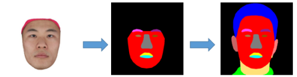

# Complete the face semantic segmentation map 

## Data Preparation
Generate training data using CelebAMask-HQ.  
```
git clone https://github.com/Andyzzz/FaceRendererTools.git  
cd face_parsing  
python get_parsing_pairs.py  
```

## Train
```
python train_percep.py
```

## Test

```
python test_parsing.py
```

Get long-hair results via:
```
python test_pre_addhair.py
python test_parsing.py
```
